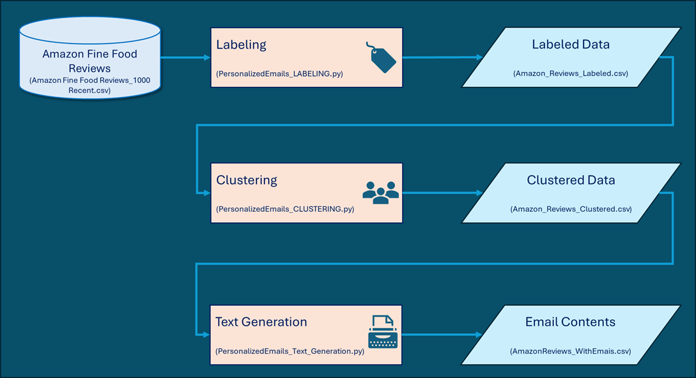

## Personalized Emails Generation (ChatGPT, Langchain)
This application leverages ChatGPT and Langchain functionalities to extract structured data from unstructured text, specifically customer comments on received products. The processed data is then used to cluster customers into distinct segments, enabling the creation of personalized email campaigns. These targeted emails are designed to promote a new product, enhancing marketing effectiveness and customer engagement.

The current application is not to be used for direct integration into a production process. Instead, it serves as a demonstration of how ChatGPT and Langchain functionalities can be leveraged to customize communications based on historical events and data.

### Incentive 
In today's competitive market, effective communication between businesses and their customers is essential, especially when introducing new products or services. Tailoring these messages to reflect the unique relationship a customer has with a business can significantly enhance engagement. 
This project explores a method that leverages customer comments to classify their acceptance and satisfaction levels with the company's products. By analyzing these insights, businesses can generate personalized promotional content when launching new products. This approach ensures that the communication is aligned with the customers' past experiences and perceptions, fostering a more meaningful connection.

### Process Overview 
The generation of emails contents follows the below steps: 

### Features
- **Source Data**: The application uses as source data file the **Amazon Fine Food Reviews** (file:///D:/DATASETS/AMAZON%20Fine%20Food%20Reviews/Amazon%20Fine%20Food%20Reviews.mhtml) 
This dataset consists of reviews of fine foods from amazon. The most recent 1,000 records have been selected from this dataset. The text fileds *Summary* and *Text* are added in a new field *Comment* that is to be fed to the LLM for the labeling process.
- **Labeling process**: The run of *PersonalizedEmails_LABELING.py* invokes OpenAI LLM model to extract from each *Ccomment* a structure of required data:
  - **product**: as the product that the buyer is commenting on
  - **sentiment**: as the sentiment expressed in the text, categorized as: 'very negative,' 'negative,' 'neutral,' 'positive,' or 'very positive
  - **aggressiveness**: as the level of aggressiveness in the text, rated on a scale from 1 to 10
  - **satisfaction**:as the user's satisfaction with the product, rated on a scale from 1 to 5
  - **confidence**: as the confidence level in the extracted properties, rated on a scale from 1 to 5. The confidence level is used to filter the data excluding records with low confidence  
The process saves the results as *intermediate_data/Amazon_Reviews_Labeled.csv*
- **Clustering**: The run of the *PersonalizedEmails_CLUSTERING.py* excludes records with customers' feddback discrepancies (i.e. when Score given by a customer is quite different from the *sentiment* of *satisfaction* level). The *kMeans* model is used to cluster the data and the results are saved in *intermediate_data/Amazon_Reviews_Clustered.csv*.  The Jupyter file *PersonalizedEmails_CLUSTERING.ipynb* is also available as it contains useful visualization outputs. 
- **Text Generation**: The run of the *PersonalizedEmails_Text_Generation.py*  gets the results of the Clustering process and maps the numerical values of each Cluster (actually the mean values) to categorial values. These categorial values are used to formulate a prompt per Cluster and ask a LLM to generate email context. The results are saved in *results/AmazonReviews_WithEmais.csv*

- ### How to run the app:
- https://github.com/antdragiotis/Personalize-emails-LangChain-
- change directory to cloned repository cd your-folder-path
- pip install -r requirements.txt 
- run the three processes described above as: 
  - PersonalizedEmails_LABELING.py
  - PersonalizedEmails_CLUSTERING.py
  - PersonalizedEmails_Text_Generation.py

You get the results from the *results/AmazonReviews_WithEmais.csv* file

### Project Structure
- *.py: main application code as the processes to run
- source_data: directory with the source data file
- intermediate_data: directory with intermediate data files that facilitating control and validations
- results: directory with the final output file
- README.md: Project documentation